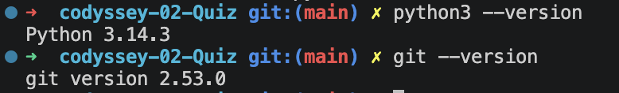
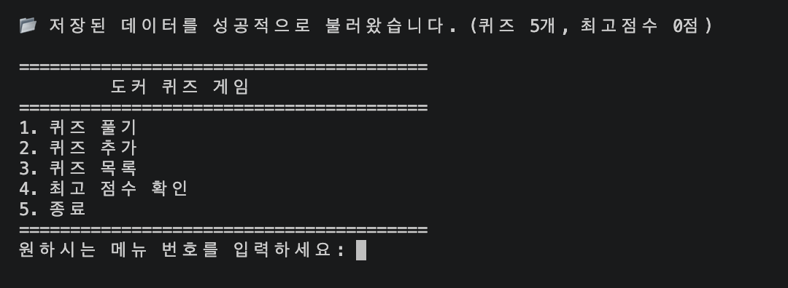
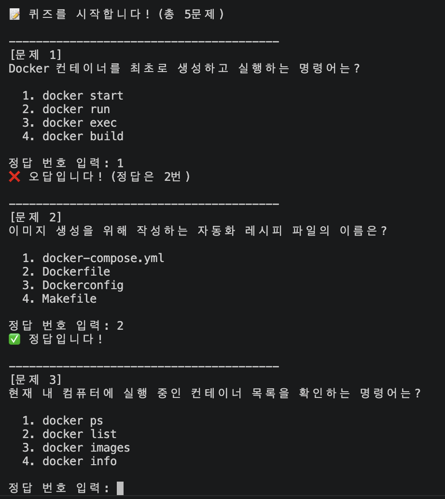
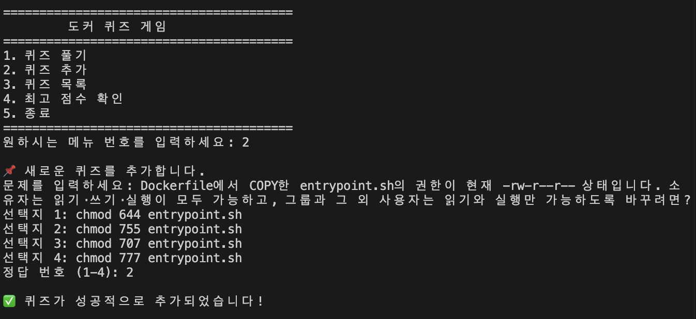
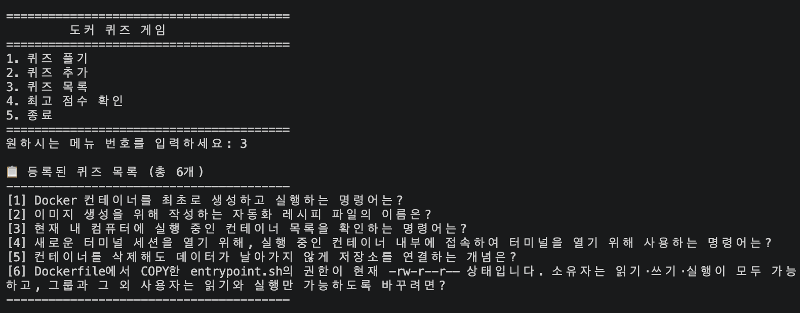
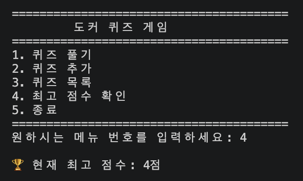
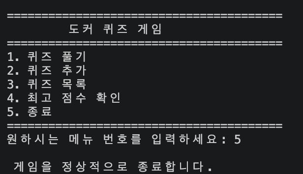
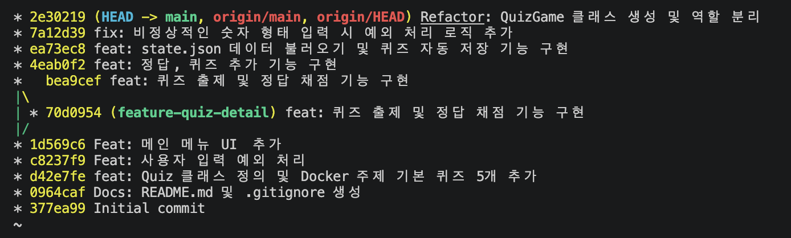

# 도커 퀴즈 게임 

## 1. 프로젝트 개요
터미널 환경에서 동작하는 파이썬 기반의 콘솔 퀴즈 게임입니다. 
객체 지향 프로그래밍(OOP)을 활용하여 클래스로 코드를 구조화하였으며, JSON 파일 입출력을 통해 프로그램 종료 후에도 데이터(퀴즈 목록, 최고 점수)를 영구적으로 보존합니다.

## 2. 퀴즈 주제 선정 이유
**주제: Docker 기본 지식**
- 1주차에서 배운 도커(Docker)의 핵심 개념과 명령어들을 복습하고 확실히 내 것으로 만들기 위해 해당 주제를 선정했습니다.

## 3. 개발 환경 및 제약 사항 반영
과제 가이드라인(`notice.md`)의 모든 요구사항과 제약사항을 준수하여 개발되었습니다.
- **Python 환경**: Python 3.10 이상
- **외부 라이브러리 금지**: `json`, `os`, `sys` 등 파이썬 표준 라이브러리만을 활용하여 구현했습니다.
- **클래스 역할 분리 (최소 2개 이상)**: 
  - `Quiz` 클래스: 개별 퀴즈 데이터를 담고 관리 (JSON 직렬화 담당)
  - `QuizGame` 클래스: 게임의 상태(퀴즈 리스트, 점수) 관리 및 전반적인 비즈니스 로직(출제, 저장, 추가) 담당
- **Git 워크플로우**: 최소 10개 이상의 기능 단위 커밋(Feat, Fix, Refactor, Docs)을 작성하였으며, 브랜치를 생성하고 병합(`checkout`, `merge`)하는 실무 협업 흐름을 적용했습니다.

## 4. 실행 방법
```bash
# 터미널에서 프로젝트 폴더로 이동 후 아래 명령어를 실행하세요.
python main.py
```

## 5. 핵심 기능 목록
- **퀴즈 풀기**: 저장된 퀴즈를 순서대로 풀고 정답을 채점합니다.
- **퀴즈 추가**: 새로운 퀴즈 내용(문제, 4지선다, 정답)을 터미널에서 직접 등록할 수 있습니다.
- **퀴즈 목록 조회**: 현재 등록되어 있는 퀴즈들의 목록을 한눈에 확인합니다.
- **최고 점수 확인**: 역대 가장 많이 맞힌 최고 점수 기록을 확인합니다.
- **데이터 영속성 보장**: 프로그램을 종료해도 `state.json` 파일에 저장되어 데이터가 날아가지 않습니다.
- **사용자 입력 방어 (예외 처리)**: 빈칸, 문자열, 범위 이탈 등 잘못된 입력을 무한 루프로 튕겨내며, 강제 종료(Ctrl+C) 시에도 데이터를 안전하게 저장하고 꺼지도록 설계했습니다.

## 6. 파일 구조
```text
codyssey-02-Quiz
 ┣ assets/        # 스크린샷 및 트러블슈팅 이미지 폴더
 ┣ main.py        # 프로그램 실행 진입점 (메뉴 UI 출력)
 ┣ quiz.py        # 핵심 비즈니스 로직 (Quiz, QuizGame 클래스)
 ┣ utils.py       # 공통 유틸리티 (예외 처리 전담 함수 등)
 ┣ state.json     # 퀴즈 데이터 및 최고 점수가 저장되는 파일
 ┣ .gitignore     # Git 제외 파일 목록
 ┗ README.md      # 프로젝트 설명서 (현재 파일)
```

## 7. 데이터 파일 설명 (`state.json`)
프로그램의 상태를 영구적으로 기록하는 UTF-8 인코딩의 JSON 파일입니다. 프로젝트 최상단 디렉터리에 위치하며 다음과 같은 스키마 구조를 가집니다.

**💡 예외 처리 (파일 부재 및 손상 방어)**
프로그램을 처음 실행하여 `state.json` 파일이 존재하지 않거나, 내용이 손상되어 읽을 수 없는 경우 프로그램이 강제 종료되지 않도록 `try-except`로 방어했습니다. 이때는 본 프로젝트의 학습 주제에 맞춰 **'파이썬 기초 및 클래스/객체 개념'을 묻는 5개의 기본 퀴즈 데이터**를 자동으로 불러와 게임을 정상적으로 진행할 수 있게 합니다.

```json
{
    "quizzes": [
        {
            "question": "파이썬에서 객체를 생성하기 위한 '틀'은?",
            "choices": ["class", "function", "method", "instance"],
            "answer": 1
        }
    ],
    "best_score": 3
}
```

## 8. 🛠️ 트러블슈팅: 꼼꼼한 예외 처리 로직 구현
사용자로부터 정답 번호를 입력받는 도중, **`004` 같은 입력이 에러 없이 숫자 `4`로 정상 인식되어 오작동을 일으키는 문제**를 발견했습니다. (파이썬의 `int("004")`가 정상 처리되기 때문)

- **해결 로직 (`utils.py`)**: `int()` 변환에 성공하더라도, 원본 입력 문자열(`user_input`)과 변환된 숫자를 다시 문자로 바꾼 값(`str(choice)`)이 일치하는지 비교하는 방어 로직을 추가했습니다.

**[수정 전 버그 상황: 004가 통과되는 모습]**  


**[수정 후 해결 상황: 비정상 형태 차단 성공]**  


## 9. 과제 제출용 스크린샷
### 1) 개발 환경 설정 스크린샷 (VSCode, Python 버전, Git 설정 등)


### 2) 프로그램 실행 결과 스크린샷 (메뉴, 퀴즈 추가, 목록, 플레이, 점수 확인 등)

**[메인 메뉴 화면]**  

**[기능별 실행 결과 (5단계)]**

| 1. 퀴즈 풀기 | 2. 퀴즈 추가 |
| :---: | :---: |
|  |  |
| **3. 퀴즈 목록** | **4. 최고 점수 확인** |
|  |  |
| **5. 안전한 종료 및 데이터 자동 저장** | |
|  | |

### 3) Git 커밋 히스토리 (`git log --oneline --graph` 결과)
